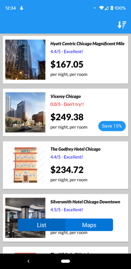

# Welcome to HotelFinder!

This is a repository for a HotelFinder demo. 
You can get hotels nearby (Mocked by calling API) in a list or on the map. 
You can sort the hotels in the list view mode based on their name, ratings, and price. 
You can switch between list view mode and maps view mode. 

# Architecture

HotelFinder is using **MVVM** design pattern and implemented in Java. 

The picture above is from https://androidwave.com/mvvm-architecture-app-in-android/

# Libraries used in this app
Room  
Retrofit  
Dagger 2  
LiveData  
RxJava  
  
Google Maps and Google Maps Utils  
Timber  
Lombok  
Easy permission  
  
Material design  
BootStrap   
  
  ### List View
  
 
  
  ### Map View
  
 
  
  ### Hotel Details
  
 
